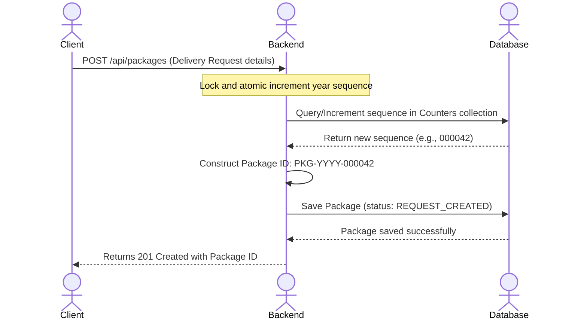
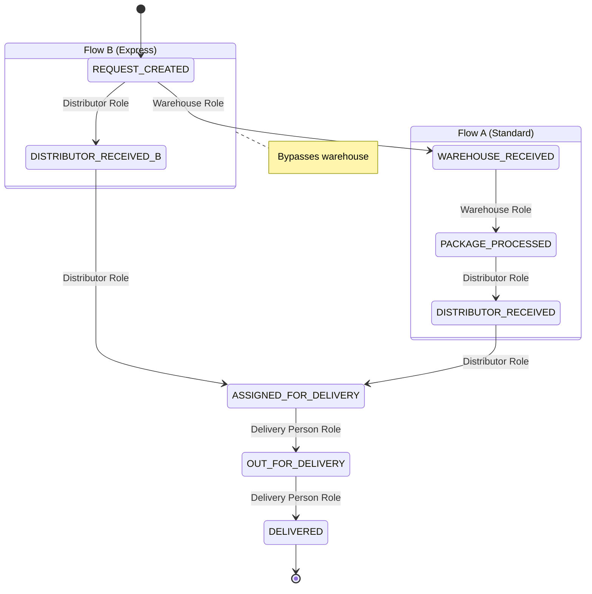

# Technical Documentation & Implementation Blueprint
## MERN Logistics Tracking System

This document serves as the Technical Documentation and Implementation Blueprint (Layer 1) for the College-Level MERN Logistics Tracking System. It establishes the architectural guidelines, database schemas, state transition rules, and API design to be implemented in subsequent phases.

---

### 1. Project Overview & Problem Statement
Modern logistics systems require absolute visibility, secure chain-of-custody tracking, and robust role-based access control (RBAC). In a typical university or mid-size business logistics scenario, shipments move through distinct handlers (e.g., Warehouse operators, Distributors, and Delivery staff) before reaching the Client.

#### Key Problems Addressed:
* **Chain of Custody Verification**: Preventing status updates from unauthorized parties or bypassing critical checkpoints.
* **Flexible Workflows**: Accommodating different shipment routes (e.g., standard warehouse-to-distributor flow vs. express direct-to-distributor flow).
* **Concurrency and Uniqueness**: Generating sequential, human-readable package identifiers (e.g., `PKG-2026-000001`) safely without duplicates or race conditions in a NoSQL database.
* **Data Isolation**: Restricting clients and delivery personnel from accessing unauthorized records.

---

### 2. User Roles & Permissions
The system enforces strict Role-Based Access Control (RBAC) with five distinct roles:

| Role | Description | Core Responsibilities | Scope of Access |
|---|---|---|---|
| **Client** | The sender/recipient of the shipment | Creates delivery requests, views own packages and their history. | Restricted to packages they created. |
| **Warehouse** | Staff managing storage and processing | Scans packages in, processes/packs shipments. | Read/write access only to warehouse-bound packages. |
| **Distributor** | Logistics hub operator | Receives shipments at the distributor hub, assigns packages to delivery staff. | Read/write access to hub-bound packages. |
| **Delivery Person** | Courier/Driver | Dispatches packages, records final deliveries. | Restricted to packages assigned to them. |
| **Admin** | System manager | Overviews all packages, users, and full system history. | Global read access; user management. |

---

### 3. Business Workflow
Unlike traditional courier systems where users input physical barcodes immediately, this system operates on a **Request-First Workflow**:



#### Steps:
1. **Client Creates Request**: The client submits details (description, weight, dimensions, destination, and flow preference: standard vs. express).
2. **System Generates Identifier**: The backend catches the request, determines the current calendar year, atomically increments the counter, formats the ID, and persists the package with `REQUEST_CREATED` status.
3. **Dispatch & Handling**: The package is physically handed over and moves through statuses depending on the chosen route flow (Flow A vs. Flow B).

---

### 4. Package Lifecycle & Status Transition Table
The system supports two distinct lifecycles:
* **Flow A (Standard)**: Involves sorting and processing at a centralized warehouse.
* **Flow B (Express)**: Bypasses the warehouse, going directly to a regional distributor.

#### Transition Matrix:

| Current Status | Allowed Next Status | Allowed Role | Workflow Flow | API Endpoint |
|---|---|---|---|---|
| **REQUEST_CREATED** | `WAREHOUSE_RECEIVED` | Warehouse | Flow A | `PATCH /api/warehouse/packages/:packageId/receive` |
| **REQUEST_CREATED** | `DISTRIBUTOR_RECEIVED` | Distributor | Flow B | `PATCH /api/distributor/packages/:packageId/receive` |
| **WAREHOUSE_RECEIVED** | `PACKAGE_PROCESSED` | Warehouse | Flow A | `PATCH /api/warehouse/packages/:packageId/process` |
| **PACKAGE_PROCESSED** | `DISTRIBUTOR_RECEIVED` | Distributor | Flow A | `PATCH /api/distributor/packages/:packageId/receive` |
| **DISTRIBUTOR_RECEIVED** | `ASSIGNED_FOR_DELIVERY` | Distributor | Flow A & B | `PATCH /api/distributor/packages/:packageId/assign` |
| **ASSIGNED_FOR_DELIVERY**| `OUT_FOR_DELIVERY` | Delivery Person | Flow A & B | `PATCH /api/delivery/packages/:packageId/out-for-delivery` |
| **OUT_FOR_DELIVERY** | `DELIVERED` | Delivery Person | Flow A & B | `PATCH /api/delivery/packages/:packageId/deliver` |



---

### 5. MongoDB Schema Design

#### Decision & Justification: PackageHistory Relationship
* **Decision**: We will store `package` as a Mongoose `ObjectId` reference (`ref: 'Package'`) in the `PackageHistory` collection, but we will also store the human-readable `packageId` (e.g. `PKG-2026-000001`) as a secondaryIndexed field.
* **Justification**:
  1. **Referential Integrity**: An `ObjectId` reference allows strict database-level relation linking and MongoDB-native performance optimizations (indexing, joins via `$lookup`). It also enables Mongoose's `.populate()` functionality.
  2. **Auditability**: Storing the string `packageId` alongside the reference simplifies raw document inspection and allows rapid history queries directly on the human-readable identifier without performing double queries.

#### Package ID Uniqueness Strategy (Atomic Counter Pattern)
To guarantee strict sequence order and prevent duplicate IDs (especially during concurrent requests), we implement a dedicated `Counters` collection.
```javascript
const CounterSchema = new Schema({
  _id: { type: String, required: true }, // Format: "PKG_SEQ_{YEAR}" (e.g. "PKG_SEQ_2026")
  seq: { type: Number, default: 0 }
});
```
We use MongoDB’s atomic `findOneAndUpdate` operation:
```javascript
const counter = await Counter.findOneAndUpdate(
  { _id: `PKG_SEQ_${year}` },
  { $inc: { seq: 1 } },
  { new: true, upsert: true }
);
// Zero-pad the counter.seq to 6 characters (e.g. 000001)
```
This isolates the counters by year and guarantees thread-safety (each call returns a guaranteed unique number).

#### Schema Definitions (Mongoose)

##### A. User Schema
```javascript
const UserSchema = new Schema({
  name: { type: String, required: true, trim: true },
  email: { type: String, required: true, unique: true, lowercase: true, trim: true },
  password: { type: String, required: true }, // Bcrypt hash
  role: { 
    type: String, 
    enum: ['client', 'warehouse', 'distributor', 'delivery_person', 'admin'], 
    required: true 
  }
}, { timestamps: true });
```

##### B. Package Schema
```javascript
const PackageSchema = new Schema({
  packageId: { type: String, required: true, unique: true, index: true }, // PKG-YYYY-XXXXXX
  client: { type: Schema.Types.ObjectId, ref: 'User', required: true },
  description: { type: String, required: true },
  weight: { type: Number, required: true }, // in kg
  dimensions: {
    length: { type: Number, required: true },
    width: { type: Number, required: true },
    height: { type: Number, required: true }
  },
  status: {
    type: String,
    enum: [
      'REQUEST_CREATED', 
      'WAREHOUSE_RECEIVED', 
      'PACKAGE_PROCESSED', 
      'DISTRIBUTOR_RECEIVED', 
      'ASSIGNED_FOR_DELIVERY', 
      'OUT_FOR_DELIVERY', 
      'DELIVERED'
    ],
    default: 'REQUEST_CREATED'
  },
  assignedDeliveryPerson: { type: Schema.Types.ObjectId, ref: 'User', default: null },
  flowType: { type: String, enum: ['standard', 'express'], default: 'standard' }
}, { timestamps: true });
```

##### C. PackageHistory Schema
```javascript
const PackageHistorySchema = new Schema({
  package: { type: Schema.Types.ObjectId, ref: 'Package', required: true, index: true },
  packageId: { type: String, required: true, index: true }, // Human readable string duplicate
  status: { type: String, required: true },
  updatedBy: { type: Schema.Types.ObjectId, ref: 'User', required: true },
  comments: { type: String, default: '' },
  location: { type: String, default: 'System' }
}, { timestamps: true });
```

---

### 6. Database Relationships
```
   [User] 1 --------* [Package] (as client)
   [User] 1 --------* [Package] (as assignedDeliveryPerson)
   
   [Package] 1 -----* [PackageHistory]
   [User] 1 --------* [PackageHistory] (as updatedBy)
```
* **User-Package (Client)**: One-to-many relationship. A user with the role `client` can own multiple packages.
* **User-Package (Delivery Person)**: One-to-many relationship. A user with the role `delivery_person` can be assigned to multiple packages.
* **Package-PackageHistory**: One-to-many relationship. A package records status updates as historical entries in the `PackageHistory` collection.
* **User-PackageHistory**: One-to-many relationship. Any status update lists the user (handler) who authorized the transition.

---

### 7. Authentication (JWT) & Authorization (RBAC) Design

#### Middleware Architecture:
1. **`protect` Middleware** (`middleware/auth.js`):
   - Extracts authorization header: `Bearer <token>`.
   - Verifies the signature of the JWT token. If expired or invalid, returns `401 Unauthorized`.
   - Decodes the token (containing user `id` and `role`).
   - Fetches the user from the database.
   - Attaches the user object to `req.user`.
2. **`authorize` Middleware** (`middleware/roles.js`):
   - Receives an array of permitted roles (e.g., `authorize('admin', 'distributor')`).
   - Compares the client's `req.user.role` with the permitted roles.
   - If not match, returns `403 Forbidden` ("Access denied: insufficient permissions").

---

### 8. Complete REST API Documentation

#### Generic Response Schema
```json
// Success
{
  "success": true,
  "message": "Operation description",
  "data": { ... }
}

// Error
{
  "success": false,
  "message": "Error reason description"
}
```

---

#### Auth Endpoints

##### 1. Register User
* **Method**: `POST`
* **URL**: `/api/auth/register`
* **Auth Required**: None
* **Request Body**:
  ```json
  {
    "name": "Jane Doe",
    "email": "jane@example.com",
    "password": "securepassword123",
    "role": "client"
  }
  ```
* **Validation Rules**: `email` must be valid and unique, `password` minimum 6 characters, `role` must be one of the enum values.
* **Success Response (201 Created)**:
  ```json
  {
    "success": true,
    "message": "Registration successful",
    "data": {
      "id": "60d5ec49f39a3e2c349a1f23",
      "name": "Jane Doe",
      "email": "jane@example.com",
      "role": "client"
    }
  }
  ```

##### 2. Login User
* **Method**: `POST`
* **URL**: `/api/auth/login`
* **Auth Required**: None
* **Request Body**:
  ```json
  {
    "email": "jane@example.com",
    "password": "securepassword123"
  }
  ```
* **Success Response (200 OK)**:
  ```json
  {
    "success": true,
    "message": "Login successful",
    "data": {
      "token": "eyJhbGciOiJIUzI1NiIsIn...",
      "user": {
        "id": "60d5ec49f39a3e2c349a1f23",
        "name": "Jane Doe",
        "email": "jane@example.com",
        "role": "client"
      }
    }
  }
  ```

##### 3. Get Current User profile
* **Method**: `GET`
* **URL**: `/api/auth/me`
* **Auth Required**: Yes (JWT)
* **Success Response (200 OK)**:
  ```json
  {
    "success": true,
    "message": "User profile retrieved",
    "data": {
      "id": "60d5ec49f39a3e2c349a1f23",
      "name": "Jane Doe",
      "email": "jane@example.com",
      "role": "client"
    }
  }
  ```

---

#### Client Endpoints (Role: `client`)

##### 1. Create Delivery Request
* **Method**: `POST`
* **URL**: `/api/packages`
* **Auth Required**: Yes (Role: `client`)
* **Request Body**:
  ```json
  {
    "description": "Lab equipment chemistry set",
    "weight": 2.5,
    "dimensions": { "length": 30, "width": 20, "height": 15 },
    "flowType": "standard"
  }
  ```
* **Success Response (201 Created)**:
  ```json
  {
    "success": true,
    "message": "Delivery request created successfully",
    "data": {
      "packageId": "PKG-2026-000001",
      "status": "REQUEST_CREATED",
      "description": "Lab equipment chemistry set",
      "weight": 2.5,
      "dimensions": { "length": 30, "width": 20, "height": 15 },
      "flowType": "standard",
      "client": "60d5ec49f39a3e2c349a1f23"
    }
  }
  ```

##### 2. Get My Packages
* **Method**: `GET`
* **URL**: `/api/packages/my`
* **Auth Required**: Yes (Role: `client`)
* **Success Response (200 OK)**:
  ```json
  {
    "success": true,
    "message": "Packages retrieved successfully",
    "data": [
      {
        "packageId": "PKG-2026-000001",
        "status": "REQUEST_CREATED",
        "description": "Lab equipment chemistry set",
        "weight": 2.5,
        "createdAt": "2026-08-22T12:00:00.000Z"
      }
    ]
  }
  ```

##### 3. Get Single Package Details (By packageId string)
* **Method**: `GET`
* **URL**: `/api/packages/:packageId`
* **Auth Required**: Yes (Role: `client` - Restricted to own packages, or `admin`)
* **Success Response (200 OK)**:
  ```json
  {
    "success": true,
    "message": "Package details retrieved",
    "data": {
      "packageId": "PKG-2026-000001",
      "status": "REQUEST_CREATED",
      "description": "Lab equipment chemistry set",
      "weight": 2.5,
      "dimensions": { "length": 30, "width": 20, "height": 15 },
      "client": { "name": "Jane Doe", "email": "jane@example.com" }
    }
  }
  ```

##### 4. Get Package History (By packageId string)
* **Method**: `GET`
* **URL**: `/api/packages/:packageId/history`
* **Auth Required**: Yes (Role: `client` - Restricted to own packages, or `admin`)
* **Success Response (200 OK)**:
  ```json
  {
    "success": true,
    "message": "Package history retrieved",
    "data": [
      {
        "status": "REQUEST_CREATED",
        "updatedBy": { "name": "Jane Doe", "role": "client" },
        "comments": "Delivery request submitted.",
        "timestamp": "2026-08-22T12:00:00.000Z"
      }
    ]
  }
  ```

---

#### Warehouse Endpoints (Role: `warehouse`)

##### 1. Get Warehouse Actionable Packages
* **Method**: `GET`
* **URL**: `/api/warehouse/packages`
* **Auth/Role Required**: Yes (Role: `warehouse`)
* **Description**: Returns all packages currently with status `REQUEST_CREATED` (with `flowType: standard`) or `WAREHOUSE_RECEIVED`.
* **Success Response (200 OK)**:
  ```json
  {
    "success": true,
    "message": "Warehouse packages retrieved",
    "data": [...]
  }
  ```

##### 2. Receive Package at Warehouse
* **Method**: `PATCH`
* **URL**: `/api/warehouse/packages/:packageId/receive`
* **Auth/Role Required**: Yes (Role: `warehouse`)
* **Request Body**:
  ```json
  {
    "location": "Warehouse Bin B-12",
    "comments": "Package checked in without external damage"
  }
  ```
* **Success Response (200 OK)**:
  ```json
  {
    "success": true,
    "message": "Package received at warehouse",
    "data": { "packageId": "PKG-2026-000001", "status": "WAREHOUSE_RECEIVED" }
  }
  ```

##### 3. Process Package at Warehouse
* **Method**: `PATCH`
* **URL**: `/api/warehouse/packages/:packageId/process`
* **Auth/Role Required**: Yes (Role: `warehouse`)
* **Request Body**:
  ```json
  {
    "location": "Sorting Area 2",
    "comments": "Sorted and boxed for distributor transport"
  }
  ```
* **Success Response (200 OK)**:
  ```json
  {
    "success": true,
    "message": "Package processed at warehouse",
    "data": { "packageId": "PKG-2026-000001", "status": "PACKAGE_PROCESSED" }
  }
  ```

---

#### Distributor Endpoints (Role: `distributor`)

##### 1. Get Distributor Actionable Packages
* **Method**: `GET`
* **URL**: `/api/distributor/packages`
* **Auth/Role Required**: Yes (Role: `distributor`)
* **Description**: Returns packages ready for distributor actions: `PACKAGE_PROCESSED`, `REQUEST_CREATED` (if `flowType: express`), and `DISTRIBUTOR_RECEIVED`.
* **Success Response (200 OK)**:
  ```json
  {
    "success": true,
    "message": "Distributor packages retrieved",
    "data": [...]
  }
  ```

##### 2. Receive Package at Distributor
* **Method**: `PATCH`
* **URL**: `/api/distributor/packages/:packageId/receive`
* **Auth/Role Required**: Yes (Role: `distributor`)
* **Request Body**:
  ```json
  {
    "location": "Main Distribution Hub",
    "comments": "Received via sorting shuttle"
  }
  ```
* **Success Response (200 OK)**:
  ```json
  {
    "success": true,
    "message": "Package received at hub",
    "data": { "packageId": "PKG-2026-000001", "status": "DISTRIBUTOR_RECEIVED" }
  }
  ```

##### 3. Assign Package for Delivery
* **Method**: `PATCH`
* **URL**: `/api/distributor/packages/:packageId/assign`
* **Auth/Role Required**: Yes (Role: `distributor`)
* **Request Body**:
  ```json
  {
    "deliveryPersonId": "60d5ec49f39a3e2c349a1f99",
    "comments": "Assigned to driver John for route 4"
  }
  ```
* **Success Response (200 OK)**:
  ```json
  {
    "success": true,
    "message": "Package assigned to delivery person",
    "data": { 
      "packageId": "PKG-2026-000001", 
      "status": "ASSIGNED_FOR_DELIVERY",
      "assignedDeliveryPerson": "60d5ec49f39a3e2c349a1f99"
    }
  }
  ```

---

#### Delivery Endpoints (Role: `delivery_person`)

##### 1. Get Assigned Packages
* **Method**: `GET`
* **URL**: `/api/delivery/packages`
* **Auth/Role Required**: Yes (Role: `delivery_person`)
* **Description**: Returns all packages assigned to the calling user that have NOT been delivered yet.
* **Success Response (200 OK)**:
  ```json
  {
    "success": true,
    "message": "Assigned packages retrieved",
    "data": [...]
  }
  ```

##### 2. Mark Package Out for Delivery
* **Method**: `PATCH`
* **URL**: `/api/delivery/packages/:packageId/out-for-delivery`
* **Auth/Role Required**: Yes (Role: `delivery_person`)
* **Description**: Checks that package is assigned to the current user and moves status to `OUT_FOR_DELIVERY`.
* **Request Body**:
  ```json
  {
    "comments": "Loaded into delivery van"
  }
  ```
* **Success Response (200 OK)**:
  ```json
  {
    "success": true,
    "message": "Package marked out for delivery",
    "data": { "packageId": "PKG-2026-000001", "status": "OUT_FOR_DELIVERY" }
  }
  ```

##### 3. Mark Package Delivered
* **Method**: `PATCH`
* **URL**: `/api/delivery/packages/:packageId/deliver`
* **Auth/Role Required**: Yes (Role: `delivery_person`)
* **Description**: Checks that package is assigned to the current user and marks it `DELIVERED`.
* **Request Body**:
  ```json
  {
    "comments": "Delivered to reception desk, signed by recipient."
  }
  ```
* **Success Response (200 OK)**:
  ```json
  {
    "success": true,
    "message": "Package marked as delivered",
    "data": { "packageId": "PKG-2026-000001", "status": "DELIVERED" }
  }
  ```

---

#### Admin Endpoints (Role: `admin`)

##### 1. Get All Users
* **Method**: `GET`
* **URL**: `/api/admin/users`
* **Auth/Role Required**: Yes (Role: `admin`)

##### 2. Get All Packages
* **Method**: `GET`
* **URL**: `/api/admin/packages`
* **Auth/Role Required**: Yes (Role: `admin`)

##### 3. Get History for Any Package
* **Method**: `GET`
* **URL**: `/api/admin/packages/:packageId/history`
* **Auth/Role Required**: Yes (Role: `admin`)

---

### 9. Frontend/Backend Integration Contract

#### A. API-to-UI Mapping Table
This map defines which views/pages invoke specific API endpoints.

| Frontend Page / Component | User Persona | API Endpoint Triggered | Event/Action |
|---|---|---|---|
| `/register` (RegisterPage) | Guest | `POST /api/auth/register` | User signs up |
| `/login` (LoginPage) | Guest | `POST /api/auth/login` | User logs in |
| `/dashboard/client` | Client | `GET /api/packages/my` | Dashboard loads |
| `/dashboard/client/request` | Client | `POST /api/packages` | Form submission |
| `/package/:packageId` | Client / Admin | `GET /api/packages/:packageId` | Details page loads |
| `/package/:packageId/timeline` | Client / Admin | `GET /api/packages/:packageId/history` | Timeline view loads |
| `/dashboard/warehouse` | Warehouse | `GET /api/warehouse/packages` | List display |
| `/dashboard/warehouse` | Warehouse | `PATCH /api/warehouse/packages/:packageId/receive` | "Scan In" Button Click |
| `/dashboard/warehouse` | Warehouse | `PATCH /api/warehouse/packages/:packageId/process` | "Mark Sorted" Button Click |
| `/dashboard/distributor` | Distributor | `GET /api/distributor/packages` | List display |
| `/dashboard/distributor` | Distributor | `PATCH /api/distributor/packages/:packageId/receive` | "Accept Hub" Button Click |
| `/dashboard/distributor` | Distributor | `PATCH /api/distributor/packages/:packageId/assign` | Submit Driver Assignment Dialog |
| `/dashboard/delivery` | Delivery Person | `GET /api/delivery/packages` | Duty sheet load |
| `/dashboard/delivery` | Delivery Person | `PATCH /api/delivery/packages/:packageId/out-for-delivery` | "Depart Hub" Button Click |
| `/dashboard/delivery` | Delivery Person | `PATCH /api/delivery/packages/:packageId/deliver` | "Complete Signature" Dialog |
| `/dashboard/admin` | Admin | `GET /api/admin/packages` & `/api/admin/users` | Admin console load |

#### B. Database-Operation mapping Table
Mapping core operations to Database commands.

| Action | API Endpoint | Primary Database Query / Operations |
|---|---|---|
| **Create Delivery Request** | `POST /api/packages` | 1. Atomic sequence increment: `Counter.findOneAndUpdate({_id: 'PKG_SEQ_YYYY'}, {$inc: {seq: 1}})`<br>2. Insert package details: `Package.create(...)`<br>3. Insert history record: `PackageHistory.create(...)` |
| **Mark Delivered** | `PATCH /api/delivery/packages/:packageId/deliver` | 1. Find and update package status: `Package.findOneAndUpdate({ packageId, assignedDeliveryPerson: req.user._id, status: 'OUT_FOR_DELIVERY' }, { status: 'DELIVERED' })`<br>2. Log history: `PackageHistory.create(...)` |

---

### 10. Error Handling Conventions
All API responses will standardise on HTTP status codes and the JSON schema defined below.

* **Format**:
  ```json
  {
    "success": false,
    "message": "A human-readable error description"
  }
  ```
* **Codes mapping**:
  * `400 Bad Request`: Input validation failed, invalid data format, or unauthorized/illegal lifecycle transition.
  * `401 Unauthorized`: No token, invalid JWT, or expired JWT.
  * `403 Forbidden`: Authenticated user role does not have authorization to view/edit the resource (e.g. client editing a package status, courier accessing another courier's cargo).
  * `404 Not Found`: Package or user object does not exist.
  * `500 Internal Server Error`: Unhandled application errors.

---

### 11. Sample Seed Data Design
The system database can be initialized with the following credentials (all using the password `password123`):

| Role | Name | Email | Initial Seed Packages |
|---|---|---|---|
| **Admin** | Chief Operator | `admin@logistics.edu` | View access to all records. |
| **Client** | Department of Physics | `physics@logistics.edu` | Owns `PKG-2026-000001` (`REQUEST_CREATED`, Standard route) and `PKG-2026-000002` (`WAREHOUSE_RECEIVED`, Standard route) |
| **Client** | Lab Chemistry | `chemistry@logistics.edu` | Owns `PKG-2026-000003` (`DELIVERED`, Express route) |
| **Warehouse** | Warehouse Admin | `warehouse@logistics.edu` | Access to manage Flow A reception. |
| **Distributor**| Hub Manager | `distributor@logistics.edu` | Access to manage assignments. |
| **Delivery** | Courier Alice | `alice@logistics.edu` | Assigned driver for `PKG-2026-000003` (Delivered). |
| **Delivery** | Courier Bob | `bob@logistics.edu` | Assigned driver for `PKG-2026-000004` (`ASSIGNED_FOR_DELIVERY`, Standard route). |

---

### 12. Edge Cases to Handle

1. **Race Conditions in Package ID Generation**: Handled via atomic sequence incrementing (`Counters` collection using MongoDB's `$inc` operator).
2. **Cross-Tenant Access Attempts**:
   - Clients must only access packages where `client === req.user.id`.
   - Delivery personnel must only access packages where `assignedDeliveryPerson === req.user.id`.
3. **Out-of-order Status Transitions**:
   - Explicit verification logic checks if `targetStatus` is in the allowed transition array of the package's current state. Any illegal transition triggers `400 Bad Request`.
4. **Token Expiration / Invalid Token**:
   - Middleware handles expiry (`TokenExpiredError` returning `401`).
5. **No-Warehouse (Express) vs. Warehouse (Standard) routing routing**:
   - The status transition engine checks `package.flowType`. If `express`, the package can skip from `REQUEST_CREATED` directly to `DISTRIBUTOR_RECEIVED`. If `standard`, trying to jump straight to `DISTRIBUTOR_RECEIVED` will be rejected.

---

### 13. Folder Structure

#### Backend/ Structure
```
backend/
├── config/
│   └── db.js            # MongoDB Connection configuration
├── controllers/
│   ├── authController.js
│   ├── packageController.js
│   ├── warehouseController.js
│   ├── distributorController.js
│   ├── deliveryController.js
│   └── adminController.js
├── middleware/
│   ├── auth.js          # Authentication check (JWT validation)
│   └── roles.js         # Authorization check (RBAC rules check)
├── models/
│   ├── User.js
│   ├── Package.js
│   ├── PackageHistory.js
│   └── Counter.js       # Stores counter sequence for Package IDs
├── routes/
│   ├── authRoutes.js
│   ├── packageRoutes.js
│   ├── warehouseRoutes.js
│   ├── distributorRoutes.js
│   ├── deliveryRoutes.js
│   └── adminRoutes.js
├── utils/
│   ├── statusEngine.js  # Validation logic for lifecycle transitions
│   └── idGenerator.js   # Sequence increment generator
├── server.js            # Entry Point
├── .env.example
├── package.json
└── README.md
```

#### Frontend/ Structure (For Reference)
```
frontend/
├── src/
│   ├── components/      # UI component library (Cards, Modals, Buttons)
│   ├── pages/           # Login, Client Dashboard, Warehouse View, etc.
│   ├── layouts/         # Navbar, Sidebar wrappers
│   ├── services/        # Axios API client modules
│   ├── context/         # AuthContext (keeps state of logged-in user)
│   ├── routes/          # ProtectedRoute wrappers
│   ├── App.jsx
│   └── main.jsx
```

---

### 14. Environment Variables

#### Backend (`.env`):
* `PORT`: The server port (e.g., `5000`).
* `MONGO_URI`: The connection string for MongoDB (Atlas URI or local path).
* `JWT_SECRET`: Secret key used for signing and verifying JSON Web Tokens.
* `JWT_EXPIRE`: Token expiration duration (e.g. `24h`, `7d`).
* `FRONTEND_URL`: URL of the React/Vite development server (e.g., `http://localhost:5173`) to configure CORS.

#### Frontend (`.env`):
* `VITE_API_URL`: Root backend URL (e.g. `http://localhost:5000/api`).

---

### 15. Final Implementation Checklist
- [ ] Initialize Node/Express server and configure MongoDB connection.
- [ ] Implement Mongoose models (User, Package, PackageHistory, Counter).
- [ ] Set up Authentication flow: hashed passwords, signing JWT, verifying JWT.
- [ ] Write RBAC middlewares (`protect`, `authorize`).
- [ ] Set up status transition rules database/map and validation engine.
- [ ] Write unique atomic package ID generation utility.
- [ ] Write routes and logic for registration, logins, and retrieval of active user profiles.
- [ ] Create and mount routes for client, warehouse, distributor, delivery personnel, and administrator.
- [ ] Write seed script to pre-populate roles and various package stages.
- [ ] Verify endpoint validation rules and security scope boundaries via test requests.
